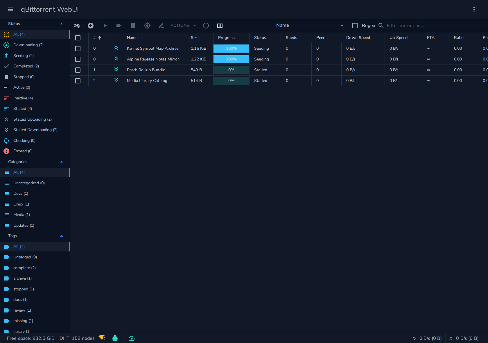
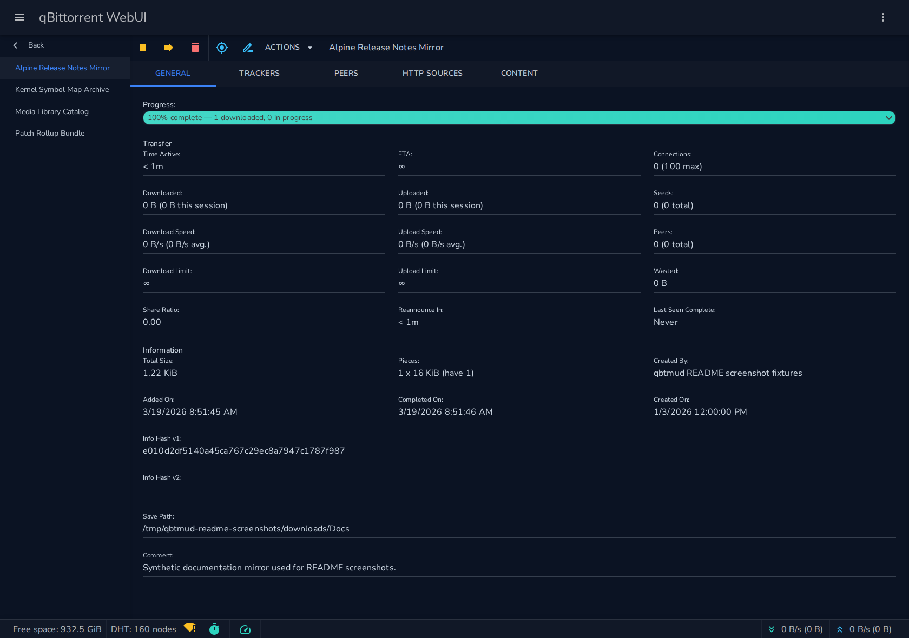
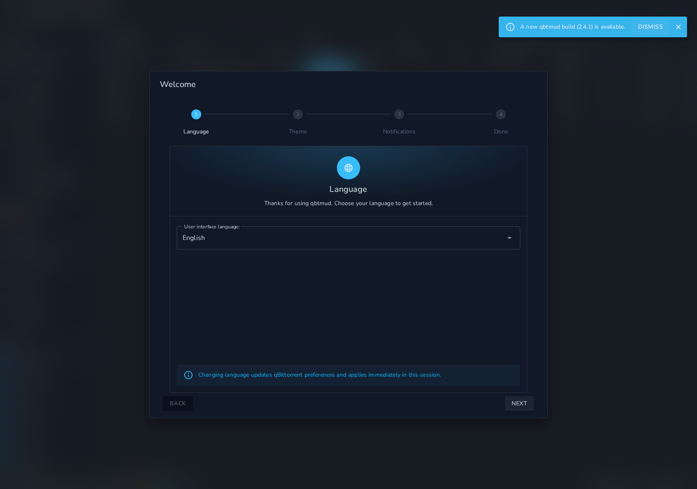
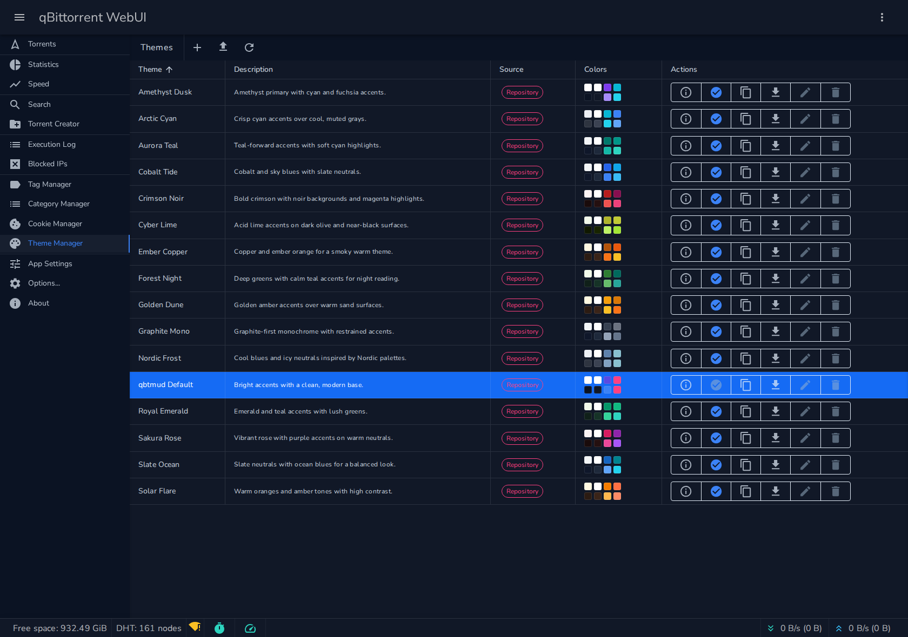
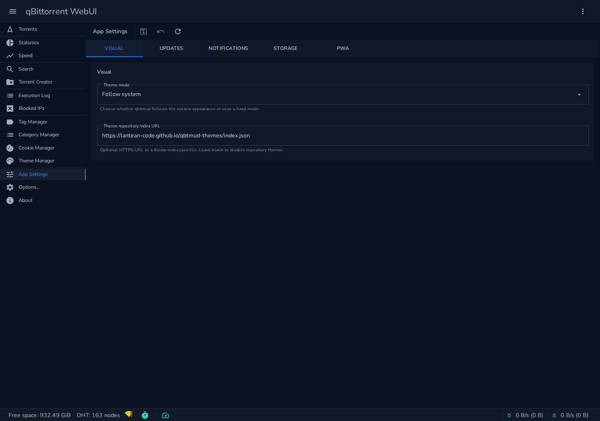

# qbtmud

qbtmud is a drop-in replacement for qBittorrent's default WebUI. It keeps qBittorrent's Web API semantics and core workflows, while adding a more polished application experience around setup, customization, browser integration, and diagnostics.

## Why qbtmud

- **Modern, touch-friendly UI** that works comfortably on desktop, tablet, and phone instead of feeling like a desktop page squeezed onto a smaller screen.
- **qBittorrent workflow coverage in a cleaner interface**, preserving the core behaviors people expect while making everyday navigation and control less clunky.
- **Built-in theme system** with bundled themes, editable local themes, previews, and repository support for a more customizable look than the default WebUI.
- **Guided first-run setup** for language, appearance, notifications, and app behavior so new and returning users can get configured quickly.
- **Installable app experience** with PWA-aware prompts, browser-specific install guidance, and magnet-handler registration to make the WebUI behave more like a real app.
- **Browser notifications with per-event controls** so you can decide exactly which torrent events should interrupt you.
- **Persistent UI personalization** including remembered layout and table preferences, so the interface stays the way you set it up.
- **Dedicated qbtmud app settings and built-in update checks** for qbtmud-specific behavior that does not belong in qBittorrent's own settings surface.

## qBittorrent Feature Support

qbtmud is intended to cover the same day-to-day workflows as the default qBittorrent WebUI, including:

- **Torrent management**: add, remove, start, stop, queue, force-start, rename, relocate, and inspect torrents.
- **Torrent details**: general stats, trackers, peers, HTTP sources, and content/file priority management.
- **Transfer controls**: global and per-torrent limits, sequential download, first and last piece priority, and super seeding.
- **Organization**: categories, tags, tracker filtering, search, RSS, logs, blocks, and torrent creation tools.
- **Client configuration**: qBittorrent preferences, bandwidth scheduling, IP filtering, IPv6 support, and related WebUI options.

For a detailed explanation of qBittorrent's underlying options, refer to the [qBittorrent Options Guide](https://github.com/qbittorrent/qBittorrent/wiki/Explanation-of-Options-in-qBittorrent).

**Main torrent dashboard with real qBittorrent-backed sample data.**



**Torrent details view covering the same core inspection workflows as the default WebUI.**



**First-run setup flow for language, theme, notifications, and storage preferences.**



**Built-in theme manager with bundled themes, previews, and editing workflows.**



**App-specific visual settings for theme mode and theme repository configuration.**



## Installation

To install qbtmud without building from source:

### 1. Download the Latest Release
- Go to the [qbtmud Releases](https://github.com/lantean-code/qbtmud/releases) page.
- Download the latest release archive for your operating system.

### 2. Extract the Archive
- Extract the archive.
- Identify the extracted directory that contains the `public` subdirectory.

### 3. Configure qBittorrent to Use qbtmud
- Open qBittorrent and navigate to `Tools` > `Options` > `Web UI`.
- Enable **Use alternative WebUI**.
- Set **Root Folder** to the extracted directory that contains `public`.
- Click **OK** to save the settings.

### 4. Access qbtmud
- Open your browser and go to the qBittorrent WebUI address, such as `http://localhost:8080`.

For more detailed instructions, refer to the [Alternate WebUI Usage Guide](https://github.com/qbittorrent/qBittorrent/wiki/Alternate-WebUI-usage).

## Building From Source

qbtmud targets the **.NET 10 SDK** pinned in [`global.json`](global.json).

### 1. Clone the Repository

```sh
git clone https://github.com/lantean-code/qbtmud.git
cd qbtmud
```

### 2. Restore and Build

```sh
dotnet restore
dotnet build
```

### 3. Publish the WebUI Files

```sh
dotnet publish src/Lantean.QBTMud/Lantean.QBTMud.csproj --configuration Release --output output/publish
mkdir -p output/alternative-ui/public
cp -a output/publish/wwwroot/. output/alternative-ui/public/
```

qBittorrent expects an alternative WebUI root folder that contains `public/`. The commands above stage the published site into `output/alternative-ui/public`.

### 4. Configure qBittorrent to Use qbtmud

Point qBittorrent's alternative WebUI root folder at `output/alternative-ui`.

### 5. Run Tests

```sh
dotnet test
```
