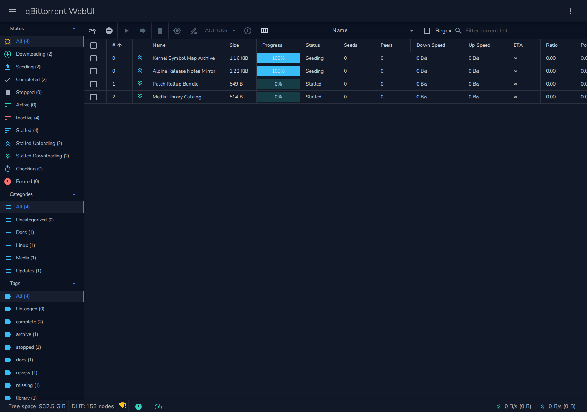
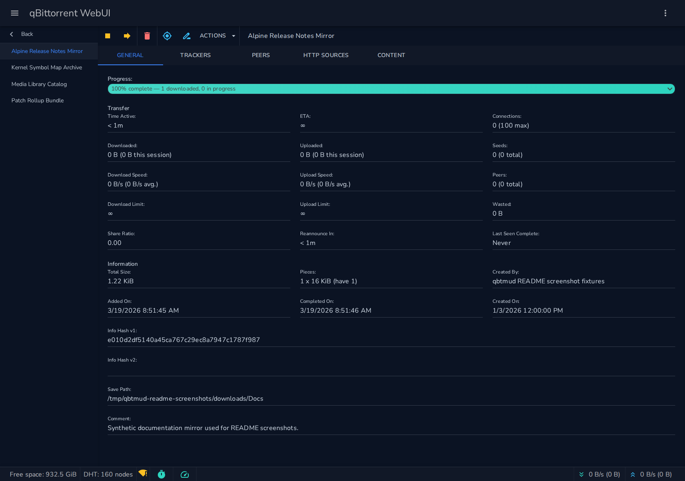
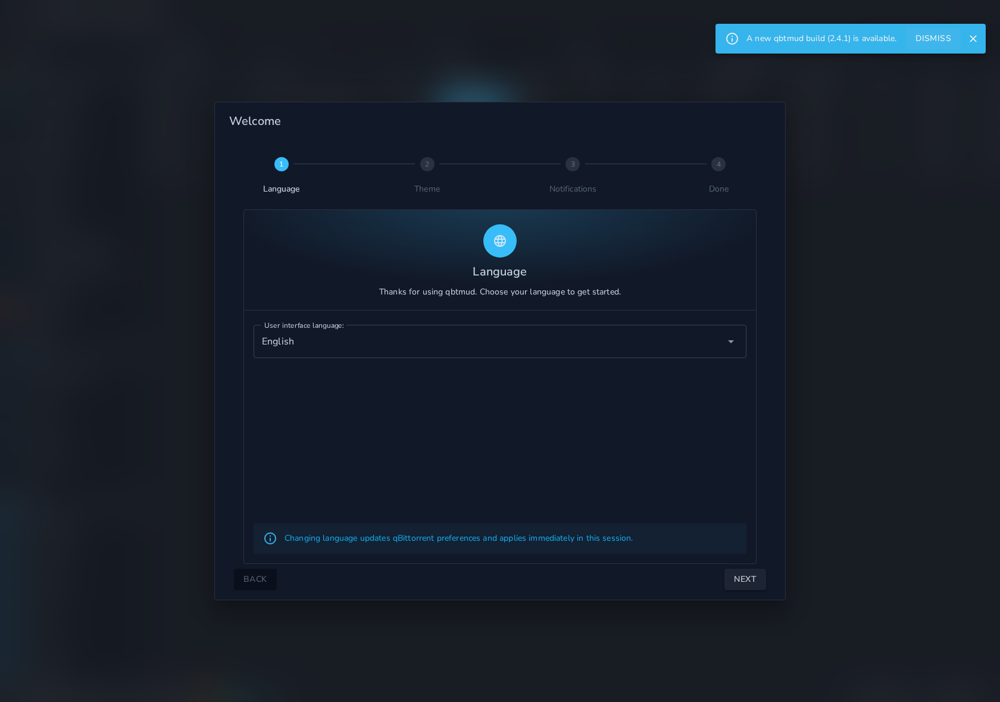
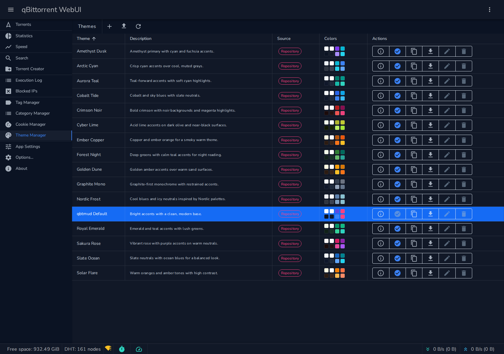
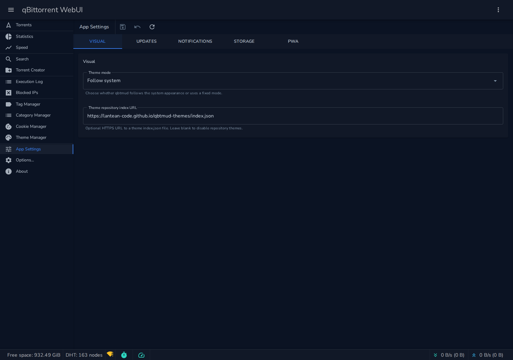

# qbtmud

qbtmud is a drop-in replacement for qBittorrent's default WebUI. It keeps qBittorrent's Web API semantics and everyday workflows, while adding a more polished application experience around setup, customisation, browser integration, and diagnostics.

## Overview

### Why qbtmud

- **Modern, touch-friendly UI** that works comfortably on desktop, tablet, and phone instead of feeling like a desktop page squeezed onto a smaller screen.
- **qBittorrent workflow coverage in a cleaner interface**, preserving the core behaviours people expect while making everyday navigation and control less clunky.
- **Built-in theme system** with bundled themes, editable local themes, previews, and repository support for a more customisable look than the default WebUI.
- **Guided first-run setup** for language, appearance, notifications, and app behaviour so new and returning users can get configured quickly.
- **Installable app experience** with PWA-aware prompts, browser-specific install guidance, and magnet-handler registration to make the WebUI behave more like a real app.
- **Browser notifications with per-event controls** so you can decide exactly which torrent events should interrupt you.
- **Persistent UI personalisation** including remembered layout and table preferences, so the interface stays the way you set it up.
- **Dedicated qbtmud app settings and built-in update checks** for qbtmud-specific behaviour that does not belong in qBittorrent's own settings surface.

### What qbtmud supports

qbtmud is intended to cover the same day-to-day workflows as the default qBittorrent WebUI, including:

- **Torrent management**: add, remove, start, stop, queue, force-start, rename, relocate, and inspect torrents.
- **Torrent details**: general stats, trackers, peers, HTTP sources, and content or file priority management.
- **Transfer controls**: global and per-torrent limits, sequential download, first and last piece priority, and super seeding.
- **Organisation**: categories, tags, tracker filtering, search, RSS, logs, blocks, and torrent creation tools.
- **Client configuration**: qBittorrent preferences, bandwidth scheduling, IP filtering, IPv6 support, and related WebUI options.

For a detailed explanation of qBittorrent's underlying options, refer to the [qBittorrent Options Guide](https://github.com/qbittorrent/qBittorrent/wiki/Explanation-of-Options-in-qBittorrent).

### Quick start

1. Download the latest archive from the [qbtmud Releases](https://github.com/lantean-code/qbtmud/releases) page.
2. Extract the archive and locate the directory that contains the `public` subdirectory.
3. In qBittorrent, go to `Tools` > `Options` > `Web UI`.
4. Enable **Use alternative WebUI**.
5. Set **Root Folder** to the extracted directory that contains `public`.
6. Save the settings and open your qBittorrent WebUI address, such as `http://localhost:8080`.

For more detail on qBittorrent's alternative WebUI mechanism, refer to the [Alternate WebUI Usage Guide](https://github.com/qbittorrent/qBittorrent/wiki/Alternate-WebUI-usage).

### Screenshots

**Main torrent dashboard.**



**Torrent details view covering the same core inspection workflows as the default WebUI.**



**First-run setup flow for language, theme, notifications, and storage preferences.**



**Built-in theme manager with bundled themes, previews, and editing workflows.**



**App-specific visual settings for theme mode and theme repository configuration.**



## Advanced Setup

### Building from source

qbtmud targets the **.NET 10 SDK** pinned in [`global.json`](global.json).

1. Clone the repository.

```sh
git clone https://github.com/lantean-code/qbtmud.git
cd qbtmud
```

2. Restore and build.

```sh
dotnet restore
dotnet build
```

3. Publish the WebUI files.

```sh
dotnet publish src/Lantean.QBTMud/Lantean.QBTMud.csproj --configuration Release --output output/publish
mkdir -p output/alternative-ui/public
cp -a output/publish/wwwroot/. output/alternative-ui/public/
```

qBittorrent expects an alternative WebUI root folder that contains `public/`. The commands above stage the published site into `output/alternative-ui/public`.

4. Point qBittorrent's alternative WebUI root folder at `output/alternative-ui`.

5. Run tests if you are validating local changes.

```sh
dotnet test
```

### Non-standard hosting notes

- **Direct alternative WebUI hosting in qBittorrent** is the default and simplest setup.
- **Reverse proxy or path-based hosting** requires the proxy to serve the app entry point for qbtmud routes as well as the API. Without that fallback, deep-link refreshes can fail.
- **Separate API and UI hosting** is possible, but you are responsible for handling routing, origin, and browser reachability correctly in your environment.

If you are working through a non-standard deployment and need help, use [GitHub Discussions Q&A](https://github.com/lantean-code/qbtmud/discussions/categories/q-a).

## Contributing

If you want to help build qbtmud:

- read [CONTRIBUTING.md](CONTRIBUTING.md) for the issue, discussion, and pull request model
- read [SUPPORT.md](SUPPORT.md) for the support and troubleshooting routing model
- use [GitHub Issues](https://github.com/lantean-code/qbtmud/issues) for actionable bugs, scoped feature proposals, UX improvements, performance regressions, and documentation gaps
- use [GitHub Discussions Ideas](https://github.com/lantean-code/qbtmud/discussions/categories/ideas) for early-stage ideas
- use [GitHub Discussions Show and tell](https://github.com/lantean-code/qbtmud/discussions/categories/show-and-tell) for themes, screenshots, integrations, and community showcases
